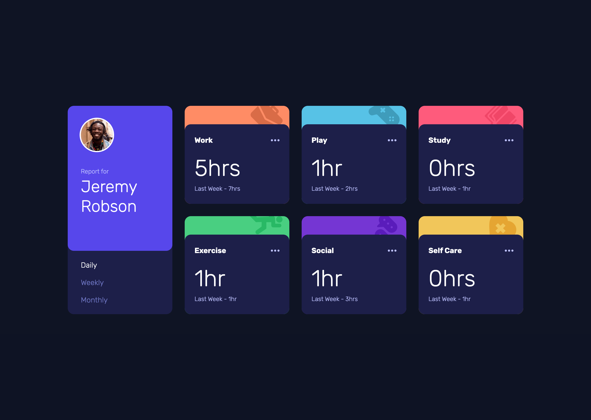

# Frontend Mentor - Time tracking dashboard solution

This is a solution to the [Time tracking dashboard challenge on Frontend Mentor](https://www.frontendmentor.io/challenges/time-tracking-dashboard-UIQ7167Jw). Frontend Mentor challenges help you improve your coding skills by building realistic projects.

## Table of contents

- [Overview](#overview)
  - [The challenge](#the-challenge)
  - [Screenshot](#screenshot)
  - [Links](#links)
- [My process](#my-process)
  - [Built with](#built-with)
  - [What I learned](#what-i-learned)
  - [Continued development](#continued-development)
  - [Useful resources](#useful-resources)
- [Author](#author)

## Overview

### The challenge

Users should be able to:

- View the optimal layout for the site depending on their device's screen size
- See hover states for all interactive elements on the page
- Switch between viewing Daily, Weekly, and Monthly stats

### Screenshot

|        Mobile designed at 375px:         |        Desktop designed at 1440px:        |
| :--------------------------------------: | :---------------------------------------: |
|  |  |

### Links

- Solution URL: [https://github.com/elisilk/time-tracking-dashboard](https://github.com/elisilk/time-tracking-dashboard)
- Live Site URL: [https://elisilk.github.io/time-tracking-dashboard/](https://elisilk.github.io/time-tracking-dashboard/)

## My process

### Built with

- Semantic HTML5 markup
- CSS custom properties
- Flexbox
- CSS Grid
- Mobile-first workflow
- Fluid typography and spacing

### What I learned

So much interesting stuff here:

- [MDN Fetching data from the server](https://developer.mozilla.org/en-US/docs/Learn/JavaScript/Client-side_web_APIs/Fetching_data) - I utilized this a lot as a model. I looked a ton at the [Can Store](https://github.com/mdn/learning-area/tree/main/javascript/apis/fetching-data/can-store) [example](https://mdn.github.io/learning-area/javascript/apis/fetching-data/can-store/), and tried to adjust that general approach to this particular situation. That example uses "filtering" which didn't seem as appropriate to this example, but nevertheless, it was a great example to build from.
- [MDN Promises](https://developer.mozilla.org/en-US/docs/Learn/JavaScript/Asynchronous/Promises)
- [MDN Working with JSON](https://developer.mozilla.org/en-US/docs/Learn/JavaScript/Objects/JSON)
- [Replacing spaces with underscores in JavaScript?](https://stackoverflow.com/questions/441018/replacing-spaces-with-underscores-in-javascript)
- [Classlist toggle on multiple elements](https://stackoverflow.com/questions/57589793/classlist-toggle-on-multiple-elements)
- [Iterating through object with `Object.keys().forEach()` changes value type](https://stackoverflow.com/questions/62602609/iterating-through-object-with-object-keys-foreach-changes-value-type)
- [The Clamp Calculator](https://royalfig.github.io/fluid-typography-calculator/) - I tend to use this fluid typography calculator because it is so nicely designed. Even though there are others that I also appreciate and use.
- [Container queries](https://developer.mozilla.org/en-US/docs/Web/CSS/CSS_containment/Container_queries) - After learning about [container queries from Kevin Powell](https://www.youtube.com/watch?v=2rlWBZ17Wes&ab_channel=KevinPowell), this is my first challenge in which I actually used them. It seemed super appropriate given that the particular of the design meant that much of the changes were based much more on the size of the content containers rather than the entire viewport.
- [background-position](https://developer.mozilla.org/en-US/docs/Web/CSS/background-position) - Had to remember how to position the background svg images.
- [Every Layout](https://every-layout.dev/layouts/sidebar/) - I have been admiring this approach for a little while now, and finally utilized it in an actual challenge. I used both The Sidebar and The Stack layiouts (both of which are free), but did some adjusting to figure out how they applied in this particular design challenge.

### Continued development

Lots of ideas came up in solving this challeng, many of which I hope to come back to.

- [Equal Columns With Flexbox: It’s More Complicated Than You Might Think](https://css-tricks.com/equal-columns-with-flexbox-its-more-complicated-than-you-might-think/) - Wow, this is an interesting discussion. The `flex: 1` solution works for me in this case, but I feel like there is so much to learn about flexbox in this article and I am struggling to really wrap my mind around all of it, so I hope to come back and revisit this one.
- [Container Query Units and Fluid Typography](https://moderncss.dev/container-query-units-and-fluid-typography/) - I didn't actually use this idea, but I did start to use container queries and am interested in coming back to this to explore more.
- [How to get the current URL in JavaScript](https://ui.dev/get-current-url-javascript) - I like the idea that the URL itself impacts the Javascript and what information is displayed. I didn't implement this yet, but I'd like it so that the `#daily` in the URL would also update the dashboard. Not exactly sure how to implement it yet, but seems doable.
  Container queries - Interestingly, in this challenge, as the viewport width gets larger, it seems like the container widths get smaller. Which makes me wonder whether it makes sense for the typography sizes to get bigger or smaller? Weird!
- [Every Layout](https://every-layout.dev/) - Should this by my new go-to for all layouts? Or just use the underlying ideas? I did really like the flow and the simpler code (without abrupt, arbitrary media queries), but there were still some challenges. I probably should also be attempting to use [Cube CSS](https://cube.fyi/) alonside this.
- Ellipsis? - What is the intention of the ellipsis in the design? What should happen when someone hovers over it and clicks it? I'm not clear. It's also weird that the entire section has a hover effect (changing the background color), which kind of obscures the effect of the ellipsis hover.
- This challenge left me with another example of injected code messing up the layout - Like last time with LastPass and the input field, this time the Every Layout sidebar used a `:last-child` selector, which was problematic because a `script` element was injected into the HTML, and so that was the effective last child. Whoops. How to account for that kind of stuff? Seems so brittle. I need to [keep searching](https://www.google.com/search?q=css+exclude+injected+code+from+grid+or+flexbox) for some better way to think of this more general problem.

### Useful resources

- [MDN Web Docs](https://developer.mozilla.org/en-US/docs/Web) - Of course, as always. So useful.

## Author

- Website - [Eli Silk](https://github.com/elisilk)
- Frontend Mentor - [@elisilk](https://www.frontendmentor.io/profile/elisilk)
